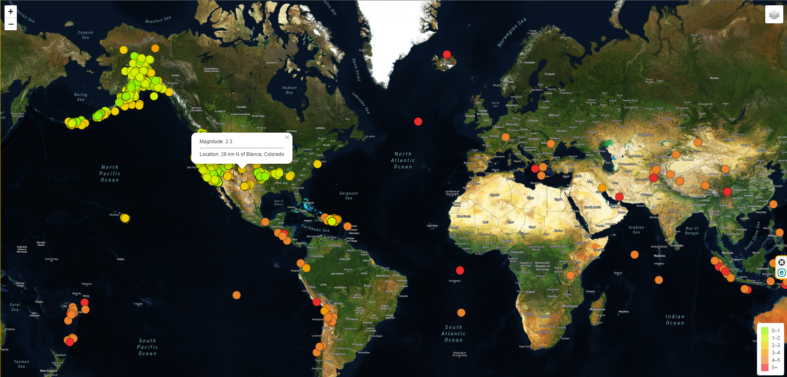
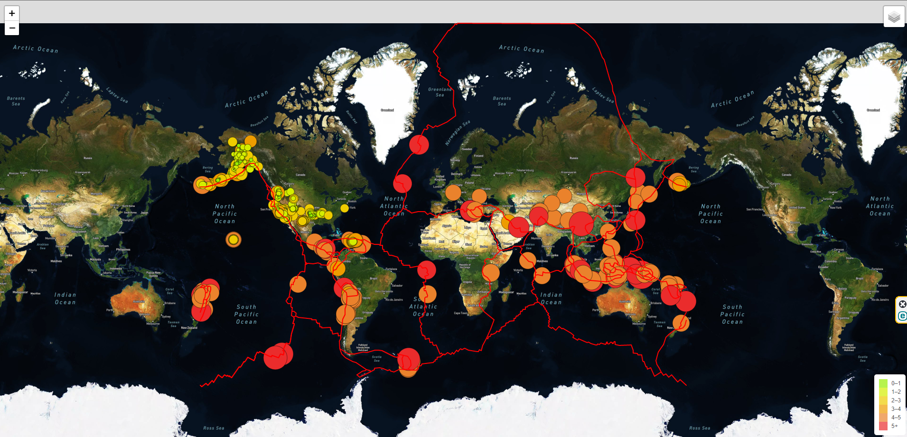
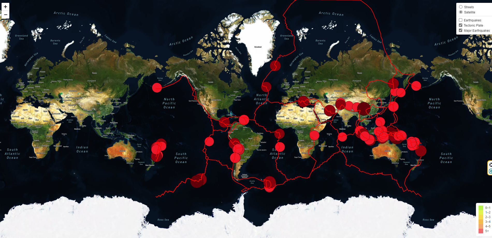
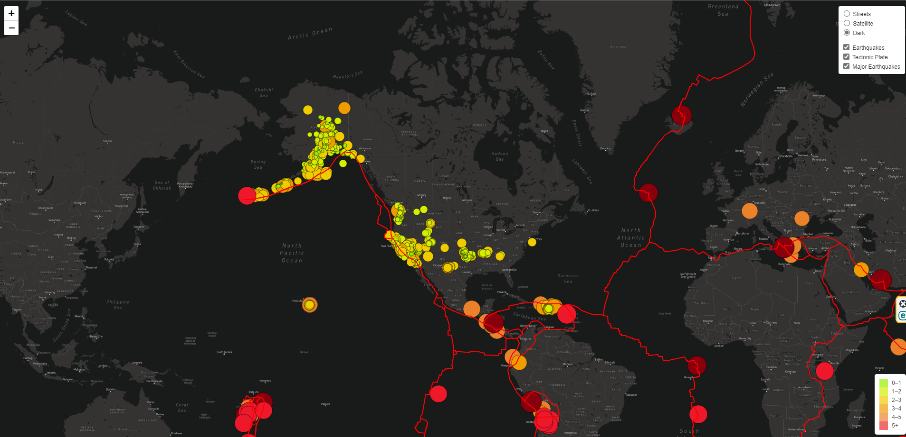

# Mapping_Earthquakes

## Project Overview:

#### One way we can tell stories with data is through interactive maps, which is what we tried to work on in this project.
#### In this project, we used the Leaflet.js Application Programming Interface (API) to populate a geographical map with GeoJSON earthquake data from the U.S.Geological Survey website, as well as from a Github Repository. Each earthquake was visually represented by a circle and color, where a higher magnitude has a larger diameter and had a darker color. In addition, each earthquake has a popup marker that, when clicked, shows the magnitude of the earthquake and the location of the earthquake.

#### Once our initial earthquake map was created, we were tasked to visualize more earthquake data on the map in relation to the tectonic plates’ location on the earth, show all the earthquakes with a magnitude greater than 4.5 on the map, and add a third style to our basemap layer.

## Outcome:

#### We used two different map styles to showcase all the earthquakes that occurred in the past seven days, worldwide.

#### The below picture adds the tectonic plates to our original map.

#### All of the Major Earthquakes, with a magnitude higher than 4.5, are displayed below, and have darker colors on the markers.

#### The final screenshot show the same information provided above, it just adds another layer to our original Streets and Satellite layers, a Dark layer, also selected as default layer, so it displays everytime our map is called.

## Summary:

#### We provided three basemap styles to showcase our data for all earthquakes happening in the past seven days in all regions of the world.
#### The data provided clearly shows that most of the major earthquakes are happening close to or by the Tectonic Plates, which makes those areas more vulnerable to earthquakes than other regions of the world.

